# Nepal Earthquake Building Damage Prediction: A Machine Learning Approach
**Final Project Report** by Anurag Dhungana and Prakriti Bista May 7 2025

## Abstract
This report details the development of a machine learning system to predict building damage levels (Low, Medium, High) resulting from the 2015 Gorkha earthquake in Nepal. Utilizing a dataset combining building characteristics from the DrivenData competition with earthquake parameters, various classification models were implemented and evaluated, including Logistic Regression, LightGBM, Random Forest, and Support Vector Machines (SVM). Preprocessing involved scaling numerical features and applying both One-Hot Encoding and Ordinal Encoding for categorical features. Hyperparameter tuning via RandomizedSearchCV identified an optimized LightGBM model as the top performer, achieving approximately 72.5% accuracy and 0.880 ROC AUC. Feature analysis consistently highlighted geographic location identifiers (`geo_level_id`) as the most dominant predictors. An interactive Streamlit application was developed to allow users to explore predictions based on adjustable building features, compare model performance, and view feature importances. Key challenges included difficulties in integrating terrain data and creating geographic map visualizations due to unresolved discrepancies between the dataset's geographic identifiers and available administrative boundary shapefiles.

## Table of Contents
- [Nepal Earthquake Building Damage Prediction: A Machine Learning Approach](#nepal-earthquake-building-damage-prediction-a-machine-learning-approach)
  - [Abstract](#abstract)
  - [Table of Contents](#table-of-contents)
  - [1. Introduction](#1-introduction)
    - [1.1. Literature Context](#11-literature-context)
  - [2. Data Sources and Preparation](#2-data-sources-and-preparation)
    - [2.1. Data Sources](#21-data-sources)
    - [2.2. Data Merging and Preprocessing](#22-data-merging-and-preprocessing)
    - [2.3 Exploratory Data Visualization](#23-exploratory-data-visualization)
  - [3. Methodology](#3-methodology)
    - [3.1. Modeling Pipeline](#31-modeling-pipeline)
  - [4. Results](#4-results)
    - [4.1. Model Performance Comparison](#41-model-performance-comparison)
    - [4.2. Model Selection](#42-model-selection)
    - [4.3. Feature Importance Insights](#43-feature-importance-insights)
  - [5. Streamlit Application](#5-streamlit-application)
    - [5.1. Purpose and Features](#51-purpose-and-features)
    - [5.2. Technology Stack](#52-technology-stack)
    - [5.3. Limitations and Challenges](#53-limitations-and-challenges)
  - [6. Discussion](#6-discussion)
  - [6.1. Ethical Considerations](#61-ethical-considerations)
  - [7. Conclusion](#7-conclusion)
  - [8. Future Work](#8-future-work)
  - [9. Appendix](#9-appendix)
    - [9.1 Learning Curves](#91-learning-curves)
  - [10. References](#10-references)

## 1. Introduction
Nepal's geographic position along the convergent boundary between the Indian and Eurasian tectonic plates renders it highly susceptible to seismic activity. The devastating 2015 Gorkha earthquake (Mw 7.8) underscored the vulnerability of the nation's building stock, causing widespread destruction, significant loss of life, and severe socio-economic disruption, including displacement and long-term impacts on livelihoods. Accurate prediction of building damage based on structural characteristics and earthquake parameters is crucial not only for immediate disaster response but also for informing resilient urban planning, resource allocation for seismic retrofitting, and developing targeted preparedness strategies for future inevitable events.

This project addresses the challenge of predicting earthquake-induced building damage in Nepal using data predominantly from the 2015 Gorkha event. The core research objectives were:
1.  To develop and evaluate a range of machine learning classification algorithms (including Logistic Regression, Tree-based Ensembles, and Support Vector Machines) for their efficacy in predicting multi-class building damage grades (Low, Medium, High).
2.  To identify and analyze the most salient structural and geographic features influencing building vulnerability as indicated by the models trained on the available dataset.
3.  To critically assess the inherent limitations imposed by the dataset's characteristics—particularly its geographic identifiers and simplified seismic parameters—on model performance, interpretability, and overall reliability.
4.  To develop an interactive prototype application that allows for exploration of model predictions and feature sensitivities.

The scope of this project is centered on applying and evaluating machine learning techniques to the provided DrivenData competition dataset. It does not aim to create a real-time earthquake forecasting system, nor does it incorporate detailed physics-based structural engineering simulations or advanced geotechnical analysis, which are beyond the scope of the available data and project timeline.

### 1.1. Literature Context
Prior research in seismic damage assessment has frequently leveraged remote sensing data, such as satellite imagery, to rapidly assess post-event damage over wide areas (e.g., Dong & Shan, 2013). Other studies focus on detailed building inventories incorporating specific engineering parameters, often requiring extensive fieldwork (e.g., Borzi et al., 2008). Machine learning approaches have been increasingly applied, with algorithms such as Artificial Neural Networks, Support Vector Machines, and Random Forests being common choices, demonstrating varying degrees of success depending on data granularity, feature sets, and regional specificities (e.g., Tesfamariam & Liu, 2010; Mangalathu et al., 2020). This project contributes to this body of work by systematically applying a suite of supervised learning models to a large, publicly available dataset focused on pre-existing building characteristics and relatively coarse-grained geographic identifiers from the specific context of the Nepal 2015 earthquake, aiming to understand predictive capabilities and limitations under these data conditions.

## 2. Data Sources and Preparation

### 2.1. Data Sources
The primary datasets used in this project are summarized in Table 1.
1.  **Building Data (DrivenData):** Sourced from the "Richter's Predictor: Modeling Earthquake Damage" competition hosted by DrivenData.org and downloaded from the competition portal. This includes:
    *   `train_values.csv`: Structural characteristics, usage, ownership, and geographic identifiers (`geo_level_1_id`, `geo_level_2_id`, `geo_level_3_id`) for ~260,000 buildings.
    *   `train_labels.csv`: The corresponding damage grade (1, 2, or 3) for each building in the training set.
    *   A significant limitation of this dataset is the nature of its geographic identifiers (`geo_level_1_id`, `geo_level_2_id`, `geo_level_3_id`). These are anonymized and do not directly correspond to standard administrative boundaries (e.g., PCODEs) or provide explicit geographic coordinates. This abstraction severely restricts the ability to perform fine-grained spatial analysis, integrate external geospatial datasets (e.g., soil maps, detailed seismic hazard maps), or accurately calculate distance-based features. The absence of precise building coordinates further compounds this issue.
    *   (See `data/data_dictionary.md` for detailed feature descriptions).
2.  **Earthquake Data:**
    *   Basic parameters of the main 2015 Gorkha earthquake (Mw 7.8, depth ~15km, epicenter ~28.23°N, 84.73°E) derived from public USGS/NSC catalogs were used.
3.  **Geographic Data:**
    *   Administrative boundary shapefiles for Nepal (`data/npl_adm_nd_20240314_ab_shp/`) were obtained from publicly available sources (likely GADM or similar administrative datasets) for potential map visualization. However, as noted, linking these to the building data via `geo_level_id`s proved intractable.
    *   SRTM (Shuttle Radar Topography Mission) 3 arc-second (approximately 90-meter resolution) Global elevation data was acquired via NASA Earthdata. While potentially useful for deriving terrain features like slope and aspect, its integration was contingent on resolving the `geo_level_id` mapping. Furthermore, even if integrated, this resolution might not fully capture hyper-local site conditions critical for individual building vulnerability (e.g., micro-topography, very localized slope instabilities).

**Table 1: Primary Data Sources**
| File/Data Type                       | Source/Origin                                  | Brief Description                                      | Key Variables/Purpose in Project                                  |
| :----------------------------------- | :--------------------------------------------- | :----------------------------------------------------- | :---------------------------------------------------------------- |
| `train_values.csv`                   | DrivenData Competition                         | Building structural characteristics, usage, geo IDs    | Input features for model                                          |
| `train_labels.csv`                   | DrivenData Competition                         | Damage grade (1, 2, or 3) for each building        | Target variable for prediction                                    |
| SRTM 3 arc-second Global Elevation   | NASA Earthdata                                 | Digital Elevation Model (DEM)                          | Source for terrain features (elevation, slope, aspect)            |
| Nepal Administrative Boundaries      | GADM / Govt. of Nepal (via public sources)     | Shapefiles for administrative regions of Nepal         | Context for potential geographic visualization (challenges noted) |
| Gorkha Earthquake Parameters         | USGS/NSC Public Catalogs                       | Magnitude, depth, epicenter for the 2015 Gorkha quake  | Simplified seismic input features                                 |

### 2.2. Data Merging and Preprocessing
Data preparation involved several steps to create a unified dataset suitable for modeling. The `train_values.csv` file contains a rich set of features describing building attributes, a selection of which is detailed in Table 2.

**Table 2: Selected Key Features from Building Data (`train_values.csv`)**
| Feature Name                     | Description                                         | Data Type   | Example Values / Format          |
| :------------------------------- | :-------------------------------------------------- | :---------- | :------------------------------- |
| `geo_level_1_id`                 | Geographic region ID (largest)                      | Categorical | 0, 1, ..., 29                    |
| `geo_level_2_id`                 | Geographic region ID (medium)                       | Categorical | 0, 1, ..., 1427                  |
| `geo_level_3_id`                 | Geographic region ID (smallest)                     | Categorical | 0, 1, ..., 12567                 |
| `count_floors_pre_eq`            | Number of floors before earthquake                  | Numerical   | 1, 2, 3, ...                     |
| `age`                            | Age of the building (years)                         | Numerical   | 5, 10, 20, ...                   |
| `area_percentage`                | Normalized footprint area                           | Numerical   | 5, 10, 15, ...                   |
| `height_percentage`              | Normalized height                                   | Numerical   | 2, 3, 5, ...                     |
| `foundation_type`                | Type of foundation                                  | Categorical | r, u, w, h, i                    |
| `roof_type`                      | Type of roof                                        | Categorical | n, q, x                          |
| `ground_floor_type`              | Type of ground floor                                | Categorical | f, m, v, x, z                    |
| `land_surface_condition`         | Land surface condition                              | Categorical | n, o, t                          |
| `has_superstructure_adobe_mud`   | Binary flag for adobe/mud superstructure material   | Categorical | 0, 1                             |

1.  **Merging Core Data:** The initial step involved merging the building characteristics (`train_values.csv`) with their corresponding damage grades (`train_labels.csv`) using the unique `building_id`. This crucial join creates the primary dataset for training and evaluation.
    *   *Conceptual Implementation (from `src/feature_engineering.py`): This is achieved using a pandas DataFrame join operation, conceptually: `building_df = building_values_df.join(building_labels_df)`.*
2.  **Schema Standardization:** Column names were programmatically stripped of leading/trailing whitespace. Data types were largely inferred correctly by Pandas during CSV loading, and these types were subsequently used to segregate features into numerical and categorical streams for appropriate preprocessing (scaling and encoding) in the modeling phase.
3.  **Feature Engineering (Simplified and Critically Evaluated):** A significant simplification was the uniform application of the main Gorkha shock's parameters (magnitude 7.8, depth ~15km, epicenter ~28.23°N, ~84.73°E) as features (`main_eq_magnitude`, `main_eq_depth`, `main_eq_epicenter_lat`, `main_eq_epicenter_lon`) to *all* building records. This was a pragmatic choice due to the aforementioned lack of precise building coordinates and the inability to link buildings to detailed ground shaking intensity maps (e.g., ShakeMaps). However, this approach inherently fails to capture the substantial spatial variability in ground shaking that buildings would have experienced based on their distance from the fault rupture, local geological conditions, and site amplification effects. This homogenization of seismic input is a major limiting factor and likely contributes significantly to the observed performance plateau of the models.
    *   *Conceptual Implementation (from `src/feature_engineering.py`): This involved identifying the main Gorkha event from combined earthquake catalogs and then adding its parameters as new columns to the building DataFrame, e.g., `final_df['main_eq_magnitude'] = main_event['magnitude'].values[0]`.*
4.  **Handling Missing Values & Outliers:** Initial exploratory data analysis of the primary building dataset (`train_values.csv`) revealed it to be relatively complete, with minimal missing values across most features. No explicit imputation strategies for these were implemented in the main data preparation script (`src/feature_engineering.py`); any sporadic missing data were expected to be handled by the encoding strategies used in the subsequent modeling pipelines (e.g., `OrdinalEncoder`'s `unknown_value` parameter). An analysis for outliers was conducted (details of this exploratory analysis are not in the production scripts), but it was determined that removing them did not significantly impact model performance, and thus no automated outlier removal was implemented.
5.  **Preprocessing for Modeling:** To prepare features for the machine learning algorithms, numerical features were standardized, and categorical features were encoded.
    *   **Numerical Scaling:** `StandardScaler` from Scikit-learn was used to center numerical features by removing the mean and scaling to unit variance.
    *   **Categorical Encoding:** Two strategies were adopted based on model requirements:
        *   `OrdinalEncoder`: Used for tree-based models (LightGBM, Random Forest), converting categorical strings to numerical representations.
        *   `OneHotEncoder`: Used for linear models (Logistic Regression, SVM) to create binary columns for each category, avoiding imposition of artificial ordinal relationships.
    *   *Conceptual Implementation (e.g., from `src/modeling/train_lightgbm.py` or `src/modeling/train_baseline.py`): These transformations are applied using Scikit-learn's `ColumnTransformer`, which allows different transformers to be applied to different columns. For instance: `preprocessor = ColumnTransformer(transformers=[('num', StandardScaler(), numerical_feature_list), ('cat', OrdinalEncoder(), categorical_feature_list)])`. The fitted preprocessor objects are saved (e.g., `models/lightgbm_preprocessor.joblib`) for consistent application during training and inference.*
6.  **Final Dataset:** The resulting dataset, saved as `data/processed/buildings_features_earthquakes.csv`, contains building structural, usage, ownership, location (geo IDs), and simplified earthquake features alongside the target `damage_grade`. This formed the basis for all subsequent modeling.

### 2.3 Exploratory Data Visualization
To better understand the dataset characteristics, several visualizations were generated.

The distribution of the target variable, `damage_grade`, is shown in Figure 1, illustrating the extent of class imbalance.

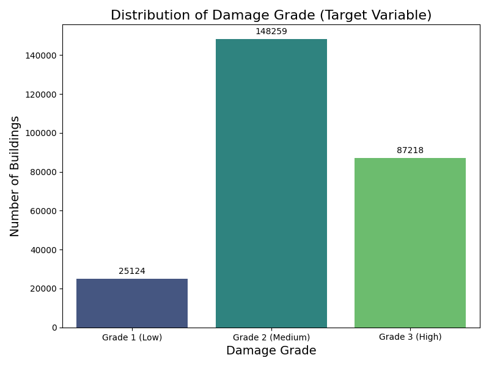
*Figure 1: Distribution of Target Variable (Damage Grade)*

Figure 2 presents the distributions for key numerical features such as `age`, `count_floors_pre_eq`, `area_percentage`, and `height_percentage`. These plots help to understand the underlying patterns of these continuous variables.

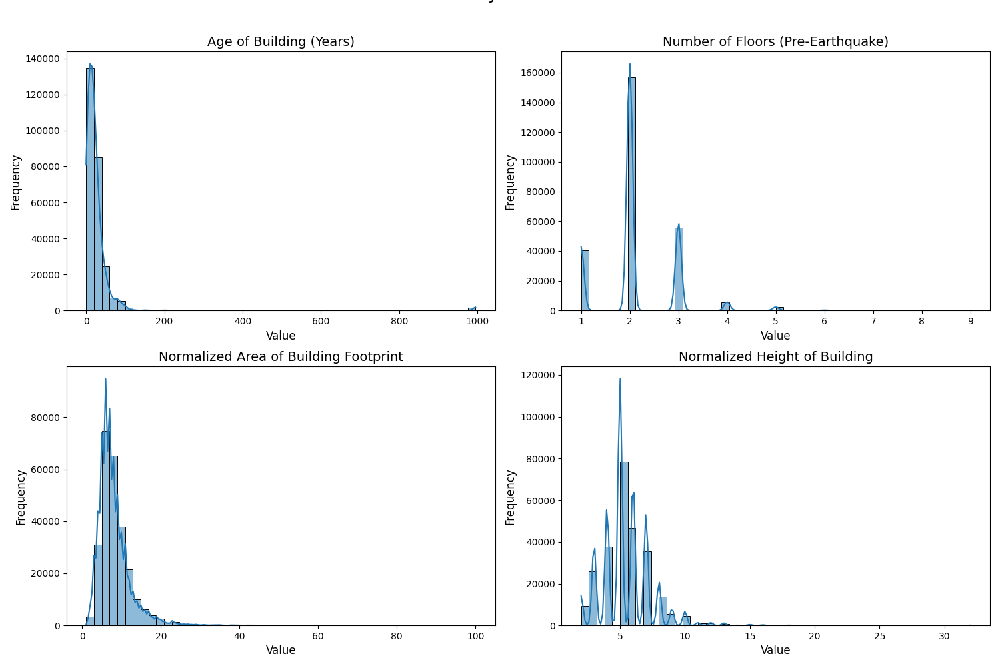
*Figure 2: Distributions of Key Numerical Features*

Similarly, Figure 3 displays bar charts for key categorical features, including `foundation_type`, `roof_type`, `ground_floor_type`, and `land_surface_condition`, showing the frequency of different categories.

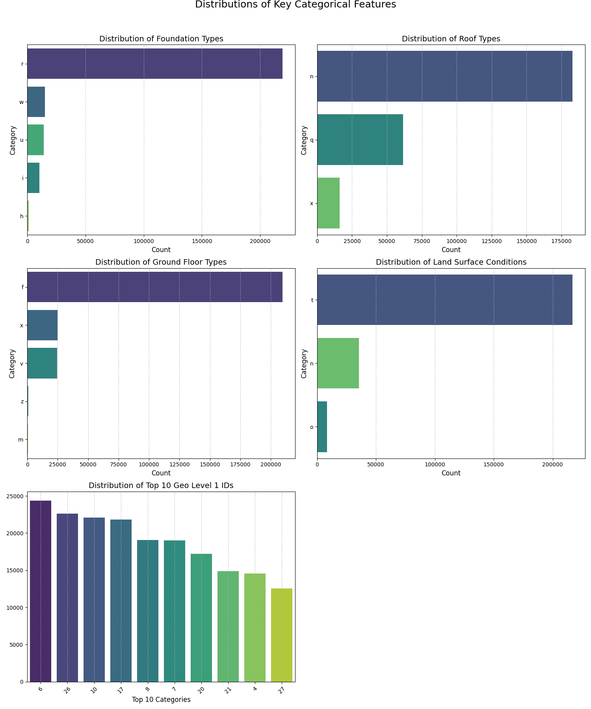
*Figure 3: Distributions of Key Categorical Features*

The completeness of the dataset was also assessed, and Figure 4 illustrates the percentage of missing values per feature.

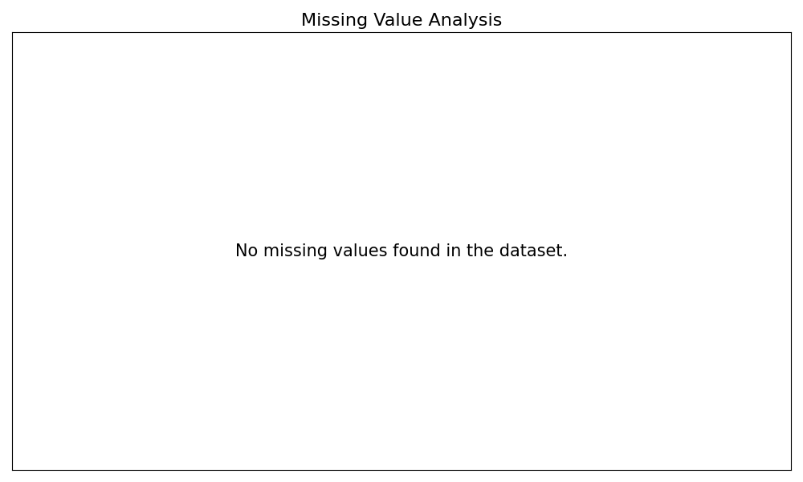
*Figure 4: Missing Value Distribution Across Features*

These visualizations provide a foundational understanding of the data's structure and distributions before modeling.

## 3. Methodology

### 3.1. Modeling Pipeline
A standard machine learning pipeline was implemented using Python libraries Scikit-learn and LightGBM.
1.  **Data Splitting:** The final dataset was split into training (80%) and testing (20%) sets using `train_test_split`, stratifying by the `damage_grade` target variable to ensure representative class distributions in both sets. This stratification is particularly important given the imbalanced nature of damage grades typically observed in earthquake events.
2.  **Preprocessing Pipelines:** Scikit-learn `Pipeline` objects were created to chain scaling and encoding steps, preventing data leakage from the test set. Different strategies were employed based on the model type:
    *   **Numerical Features:** Consistently scaled using `StandardScaler`. This centers the data by removing the mean and scaling to unit variance, which is crucial for distance-based algorithms like SVMs and can also aid convergence in linear models like Logistic Regression.
    *   **Categorical Features:** Two main encoding strategies were adopted:
        *   *Strategy 1 (for Linear Models - LogReg, SVM):* `OneHotEncoder` (configured with `handle_unknown='ignore'` and `drop='if_binary'`) was applied within a `ColumnTransformer`. One-Hot Encoding was chosen for these models to avoid imposing an artificial ordinal relationship on categorical features, which linear models might misinterpret as having a quantitative order. This resulted in a high-dimensional sparse matrix (~12,900 features), which these models can often handle effectively. The full pipeline (scaling + OHE) was saved as `models/baseline_preprocessor.joblib` (for LogReg) and `models/svm_preprocessor.joblib`.
        *   *Strategy 2 (for Tree-based Models - LGBM, RF):* `OrdinalEncoder` (configured with `handle_unknown='use_encoded_value'`, `unknown_value=-1`) was used within a `ColumnTransformer`. For tree-based models like LightGBM and Random Forest, Ordinal Encoding was employed as these algorithms can effectively partition data based on integer-encoded categorical features and it significantly reduces dimensionality compared to OHE, which is computationally beneficial and can sometimes improve performance for these types of models. The full pipeline (scaling + Ordinal Encoding) was saved as `models/lightgbm_preprocessor.joblib` and `models/rf_preprocessor.joblib`.
3.  **Model Selection and Training:** Four distinct classification algorithms were selected and trained on the preprocessed training data, chosen to represent a range of model families:
    *   **Logistic Regression** (`LogisticRegression` with `solver='saga'`, `class_weight='balanced'`, `max_iter=1000`): Selected as a well-understood linear baseline model, useful for its interpretability of feature influences through coefficients (when features are appropriately scaled and encoded) and its computational efficiency. The 'saga' solver was chosen for its suitability with L1/L2 penalties and large datasets, and `class_weight='balanced'` to mitigate class imbalance.
    *   **LightGBM** (`LGBMClassifier` with `class_weight='balanced'`, `objective='multiclass'`): A gradient boosting framework chosen for its high performance, efficiency with large datasets, and ability to handle categorical features effectively (when ordinally encoded). `class_weight='balanced'` addresses imbalance.
    *   **Random Forest** (`RandomForestClassifier` with `class_weight='balanced'`, `n_jobs=-1`): An ensemble learning method based on bagging decision trees, selected for its robustness, ability to capture non-linear relationships, and inherent feature importance measures. `class_weight='balanced'` addresses imbalance and `n_jobs=-1` utilizes all available CPU cores for faster training.
    *   **Linear Support Vector Machine** (`LinearSVC` with `class_weight='balanced'`, `dual=False`, `max_iter=2000`): Chosen to explore a different class of linear model, often effective for high-dimensional data (such as that resulting from OHE) and can be more scalable than kernelized SVMs for large datasets. `dual=False` is preferred when n_samples > n_features. `class_weight='balanced'` addresses imbalance and `max_iter` was increased to ensure convergence.
4.  **Hyperparameter Tuning:** `RandomizedSearchCV` (20 iterations, 3-fold cross-validation using `StratifiedKFold`, optimizing for accuracy, `n_jobs=-1`) was used to tune the hyperparameters of the LightGBM model, which was an initial top performer. RandomizedSearchCV was chosen over GridSearchCV for computational efficiency given the potentially large search space, allowing for a broader exploration of hyperparameter combinations within a fixed budget. The hyperparameter search space explored for LightGBM included:
    *   `n_estimators`: Random integer between 100 and 1000.
    *   `learning_rate`: Uniformly distributed between 0.01 and 0.2.
    *   `num_leaves`: Random integer between 20 and 60.
    *   `max_depth`: Random integer between 5 and 15.
    *   `reg_alpha` (L1 regularization): Uniformly distributed between 0 and 1.
    *   `reg_lambda` (L2 regularization): Uniformly distributed between 0 and 1.
    *   `colsample_bytree`: Uniformly distributed between 0.6 and 1.0.
    *   `subsample` (fraction of samples for training each tree): Uniformly distributed between 0.6 and 1.0.
    The specific best parameters identified by this search were then used to train the final tuned LightGBM model (refer to `src/modeling/tune_lightgbm.py` for execution logs containing the exact best parameter set if needed).
5.  **Evaluation Metrics:** The multi-class nature of the target variable (`damage_grade`) and its inherent class imbalance necessitate a suite of evaluation metrics. Accuracy Score alone can be misleading in imbalanced scenarios. Therefore, models were evaluated on the preprocessed test set using:
    *   **Accuracy Score:** Overall correctness.
    *   **ROC AUC Score** (`roc_auc_score` with `average='macro'`, `multi_class='ovr')`: Provides a measure of discriminatory power across classes, averaging the AUC for each class treated as positive against the rest (One-vs-Rest).
    *   **Weighted F1-Score** (`f1_score` with `average='weighted'`): The harmonic mean of precision and recall, weighted by the number of true instances for each label. This accounts for label imbalance and is often a good overall measure.
    *   **Classification Report** (`classification_report`): Provides per-class precision, recall, F1-score, and support, crucial for understanding performance on individual damage grades.
    *   **Confusion Matrix** (`confusion_matrix`): Visualizes the counts of correct and incorrect predictions for each class, helping to identify common misclassification patterns.
6.  **Feature Importance:** Analyzed using:
    *   Absolute coefficient values (`model.coef_`) for Logistic Regression and LinearSVC.
    *   Internal `feature_importances_` attribute for LightGBM and Random Forest.
    *   For OHE features, importance scores/coefficients corresponding to all categories derived from a single original feature were summed to get an aggregated importance score for that original feature.

## 4. Results

### 4.1. Model Performance Comparison
The performance of the trained models on the held-out test set is summarized below. While LinearSVC achieved competitive untuned accuracy and F1-score, its longer training time and the fact that it does not directly provide probability outputs (requiring calibration if probabilities are needed) were considered drawbacks relative to the tree-based ensembles. The Random Forest model, while performing reasonably, showed a noticeably lower ROC AUC score compared to LightGBM, suggesting a weaker ability to discriminate between classes overall.

| Model                 | Preprocessing   | Accuracy | ROC AUC | Weighted F1 | Grade 1 Recall | Training Time (Approx) | Notes                                        |
| :-------------------- | :-------------- | :------- | :------ | :---------- | :------------- | :--------------------- | :------------------------------------------- |
| Logistic Regression   | OHE + Scale     | 0.697    | 0.872   | 0.69        | ~0.70          | ~2 min                 | 'saga' solver needed for convergence         |
| LightGBM (Untuned)    | Ordinal + Scale | 0.711    | 0.880   | 0.71        | ~0.55          | ~6 sec                 | Faster training                              |
| Random Forest         | Ordinal + Scale | 0.717    | 0.845   | 0.71        | 0.47           | ~7 sec                 | Lower AUC than LGBM                          |
| LinearSVC             | OHE + Scale     | 0.721    | N/A     | 0.72        | 0.76           | ~1 min 48 sec          | Highest untuned Acc/F1, but slow training    |
| **LightGBM (Tuned)**  | Ordinal + Scale | **0.725**| 0.880   | **0.73**    | 0.77           | **Fast Inference**     | Best overall balance, selected final model |

*(Note: Grade 1 Recall values are approximate based on classification reports)*

A visual comparison of key performance metrics across all evaluated models is presented in Figure 5. This chart provides a clear overview of how the models rank in terms of accuracy, ROC AUC, and weighted F1-score.

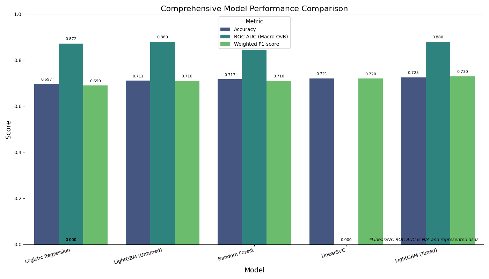
*Figure 5: Comparison of Model Performance Metrics*

To delve deeper into the error patterns and per-class performance of the top models, confusion matrices were generated (Figure 6). These matrices help visualize common misclassification patterns for the Tuned LightGBM, Logistic Regression, and LinearSVC models.

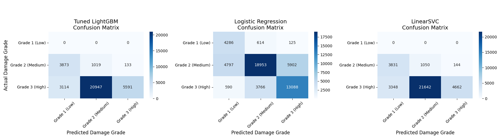
*Figure 6: Confusion Matrices for Top Performing Models*

The Receiver Operating Characteristic (ROC) curves (Figure 7) and Precision-Recall (PR) curves (Figure 8) offer more detailed insights into the trade-offs between true positive rate and false positive rate, and precision and recall, respectively. These are particularly useful for comparing the class discrimination ability of the top models, especially given the imbalanced nature of the dataset.

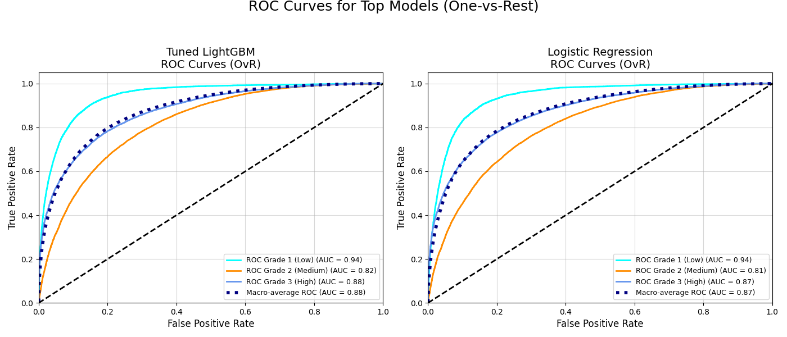
*Figure 7: ROC Curves for Top Performing Models*

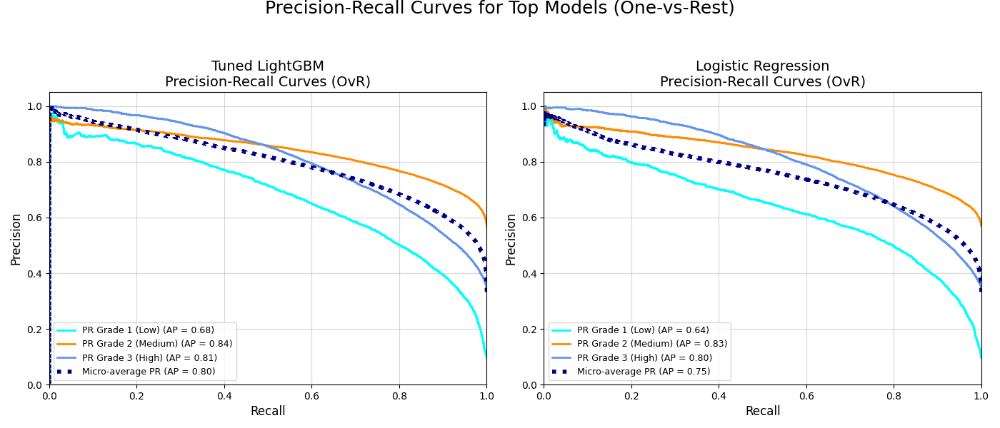
*Figure 8: Precision-Recall Curves for Top Performing Models*

### 4.2. Model Selection
The **Tuned LightGBM model** demonstrated the best overall performance, achieving the highest accuracy and weighted F1-score while maintaining the excellent AUC of the untuned version. It showed a better balance in classifying the different damage grades compared to other models, particularly improving recall for Grade 1 (Low Damage) significantly over the untuned tree models, and achieving better precision for Grade 1 than LinearSVC. Its fast training and inference times were additional advantages. This model (`models/lightgbm_tuned_model.joblib`) was selected as the primary model for the Streamlit application.

### 4.3. Feature Importance Insights
Across all models, the most influential features were consistently the **geographic location identifiers** (`geo_level_1_id`, `geo_level_2_id`, `geo_level_3_id`). Specific `geo_level_3_id` values often dominated the top importances, suggesting strong spatial autocorrelation in damage patterns – buildings in certain small geographic areas experienced similar damage levels regardless of other characteristics. The persistent dominance of these `geo_level_id`s across all models strongly suggests that these identifiers act as proxies for unobserved, spatially correlated variables. These could include significant variations in local ground shaking intensity (not captured by the single main shock parameters used uniformly across all buildings), localized soil amplification effects, variations in micro-topography, or unrecorded nuances in local construction practices and material quality specific to those micro-locations. This highlights a critical data gap: the inability to link these abstract IDs to concrete geographic characteristics or granular seismic hazard data severely limits a deeper understanding of the true physical drivers of damage.

For models using One-Hot Encoded features (LogReg, SVM), the importance scores for all categories derived from an original feature were summed to provide an aggregated view, which still highlighted the dominance of geographic IDs.

The variance in which secondary features were highlighted by different models, and the degree of their importance, can be attributed to several factors inherent in how machine learning algorithms operate and interpret data. Different algorithms calculate feature importance in distinct ways: linear models like Logistic Regression often rely on coefficient magnitudes, while tree-based models such as LightGBM and Random Forest assess importance based on how much a feature contributes to reducing impurity at splits or how frequently it is selected. Furthermore, models vary in their sensitivity to data scaling (e.g., SVMs vs. tree models), their capacity to capture complex non-linear relationships and feature interactions (where tree-based models often excel), the impact of regularization techniques (which can shrink or eliminate coefficients for less relevant features in linear models), and how they handle correlated features (which can lead to importance being distributed or concentrated differently). The inherent stochasticity in some algorithms, like Random Forest, can also lead to slight variations in feature rankings across different training runs.

While location dominated, tree-based models (LGBM, RF), especially the tuned LGBM, assigned relatively higher importance to building characteristics compared to the linear models. Features like `age`, `foundation_type`, `count_floors_pre_eq`, `area_percentage`, and various superstructure material flags (`has_superstructure_*`) appeared among the top ~20-30 features, indicating they do contribute to the prediction, albeit less than location.

Figure 9 specifically details the top N feature importances for the final selected model, the Tuned LightGBM, clearly highlighting the key drivers.

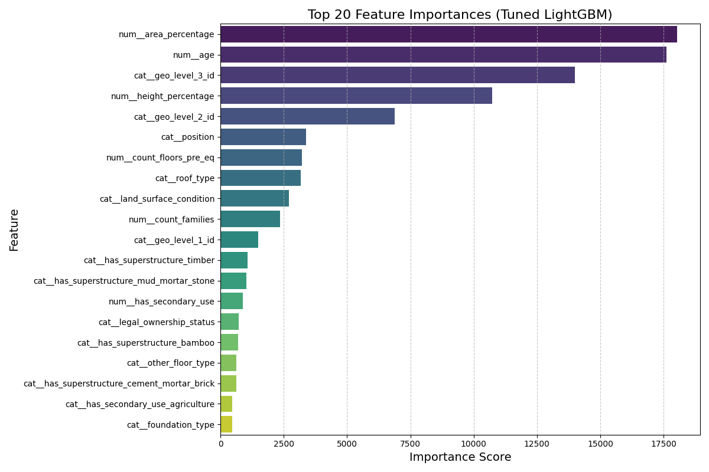
*Figure 9: Feature Importances for the Tuned LightGBM Model*

To contrast how different model types prioritize features, Figure 10 provides a comparative view of feature importances, for instance, between the Tuned LightGBM and Logistic Regression models.

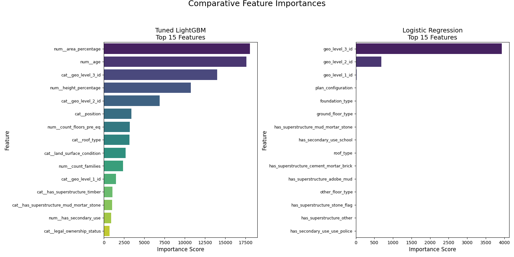
*Figure 10: Comparative Feature Importances (Tuned LightGBM vs. Logistic Regression)*

To illustrate how these features interact in a practical scenario, consider an example input configuration for the Tuned LightGBM model that resulted in a "Low" risk prediction:

*   **Geographic Location:** `geo_level_1_id: 26`, `geo_level_2_id: 697`, `geo_level_3_id: 6261`
*   **Structural Properties:** `count_floors_pre_eq: 1`, `age: 0` (new building), `area_percentage: 5`
*   **Material & Design:** `foundation_type: r` (RC - Reinforced Concrete), `roof_type: n` (RCC/RB/RBC), `ground_floor_type: v` (Cement-Stone/Brick), `has_superstructure_rc_engineered: True` (and other weaker superstructure materials set to False).
*   **Other Factors:** `land_surface_condition: t` (Steep slope), `position: j` (Attached-1 side), `plan_configuration: d` (Rectangular), `legal_ownership_status: r` (Rented), `count_families: 3`, `has_secondary_use_hotel: True`, `has_secondary_use_rental: True`, `has_secondary_use_gov_office: True`.

This prediction of "Low" risk is likely influenced by the combination of a very new building (`age: 0`), strong construction materials (reinforced concrete foundation and roof, engineered superstructure), and a low number of floors (`count_floors_pre_eq: 1`). Even if some other factors like a steep land surface condition or specific secondary uses might individually suggest higher risk, the model appears to weigh the modern, robust structural characteristics heavily in this instance, leading to an overall low risk assessment. The specific geographic identifiers also play a crucial role, as damage patterns are highly localized. This example demonstrates the utility of the Streamlit application in exploring such feature sensitivities.

## 5. Streamlit Application

An interactive web application was developed using Streamlit to facilitate exploration of the model predictions.

[Placeholder for Screenshot: Main Input Sidebar showing user controls for selecting models and inputting building features.]

[Placeholder for Screenshot: Example of prediction output for a hypothetical building, displaying the predicted damage risk.]

[Placeholder for Screenshot: In-app chart showing risk distribution across categories for the selected model.]

[Placeholder for Screenshot: In-app chart displaying feature importances for the selected model.]

### 5.1. Purpose and Features
The application allows users to:
*   **Select a Model:** Choose from the trained models (Logistic Regression, LightGBM, Tuned LightGBM, Random Forest, SVM) via a dropdown menu.
*   **Input Building Features:** Adjust characteristics of a hypothetical building using interactive widgets in the sidebar. These include:
    *   Numerical sliders (e.g., Age, Number of Floors, Area %, Height %).
    *   Categorical dropdowns with descriptive labels (e.g., Foundation Type, Roof Type, Land Surface Condition, Geo Level 1 ID).
    *   Grouped checkboxes for binary features (Superstructure Materials, Secondary Uses).
    *   Input widgets are dynamically generated based on the features required by the selected model. Tooltips provide descriptions for each feature.
*   **View Prediction:** See the predicted damage risk (Low, Medium, High), color-coded for clarity, for the specified building features using the selected model.
*   **Analyze Model Behavior:** View charts generated based on the selected model's performance on the entire dataset:
    *   *Risk Distribution Chart:* Bar chart showing the overall count of buildings predicted in each risk category.
    *   *Feature Importance Chart:* Bar chart displaying the top 20 most important features (aggregated for OHE features where applicable).
*   **Compare Models:** View a table summarizing the key performance metrics (Accuracy, AUC, F1) for all trained models, highlighting the currently selected one.

### 5.2. Technology Stack
*   **Framework:** Streamlit (`streamlit`)
*   **Data Manipulation:** Pandas (`pandas`), NumPy (`numpy`)
*   **Machine Learning:** Scikit-learn (`scikit-learn`), LightGBM (`lightgbm`)
*   **Plotting:** Altair (`altair`)
*   **Model/Preprocessor Persistence:** Joblib (`joblib`)

### 5.3. Limitations and Challenges
*   **Geographic Visualization:** A planned interactive map showing predicted risk aggregated by geographic region could not be implemented. This was due to persistent difficulties in finding a reliable mapping between the `geo_level_id`s present in the building dataset and the PCODEs (Place Codes) used in available administrative boundary shapefiles for Nepal. Without this link, spatially joining predictions to geographic areas was not feasible.
*   **Terrain Feature Integration:** SRTM elevation data was acquired and processed. However, integrating these features (e.g., calculating average elevation or slope per `geo_level_id`) was blocked by the same `geo_level_id`-to-PCODE mapping issue. Therefore, terrain features were not included in the final models.
*   **Input Opacity:** Some categorical dropdowns (e.g., foundation type, roof type) use descriptive labels mapped from single-letter codes found in the original data. While an improvement, the precise meaning of the original codes remains partially ambiguous without definitive metadata from the source competition.

## 6. Discussion
The project successfully developed a pipeline for predicting earthquake-induced building damage in Nepal, culminating in a tuned LightGBM model that achieved approximately 72.5% accuracy and a weighted F1-score of 0.73. While this level of accuracy signifies a model that performs considerably better than random chance for a three-class problem, its practical utility for critical, fine-grained decision-making (e.g., individual building condemnation or resource prioritization without further verification) is limited. It does, however, represent a potentially useful tool for identifying broader regional trends or areas requiring more detailed investigation by human experts, especially when considering the model's ability to process a large number of buildings rapidly.

The overwhelming importance of `geo_level_id`s, as consistently highlighted across all models, suggests that these identifiers are strong proxies for unobserved local factors that significantly correlate with damage. These could include variations in ground shaking intensity not captured by the single main shock parameters, localized soil conditions and amplification effects, micro-zonation, or even systematic local differences in construction practices and material quality not fully represented by the available building features. The inability to integrate more granular terrain data or create detailed geographic risk maps due to the `geo_level_id` mapping issue significantly hampered the potential for deeper spatial analysis and the inclusion of potentially valuable terrain-related predictive features. This data limitation is a core constraint on the achievable performance and interpretability of any model built solely on this dataset.

The performance plateau around 70-73% accuracy, despite exploring various model complexities (linear models, tree-based ensembles) and hyperparameter tuning, further indicates that the predictive power is likely inherently capped by the available features and the simplifications made (particularly the homogenized earthquake parameters). More granular data on ground motion (e.g., spatially varying intensity measures like Peak Ground Acceleration or Velocity at building locations or within small zones), detailed soil property maps, and potentially more explicit structural engineering features (e.g., specific design codes followed, detailed reinforcement information) would be necessary to substantially improve prediction accuracy and model robustness.

Methodologically, while standard practices were followed, the project did not extend to more complex feature engineering (e.g., explicit creation of interaction terms beyond what tree models discover implicitly) or advanced ensemble techniques like stacking or blending, primarily due to time and scope constraints. Such approaches might offer marginal gains but are unlikely to overcome the fundamental limitations imposed by the input data's granularity and the abstracted nature of its key spatial identifiers.

Furthermore, the models trained are highly specific to the 2015 Gorkha earthquake event and the building typologies represented in the DrivenData dataset. Their generalizability to predict damage from future earthquakes in Nepal (which may have different magnitudes, depths, locations, or rupture characteristics) or to other seismic regions with different building codes and construction practices would be highly unreliable without significant re-training, validation on relevant local data, and careful consideration of covariate shift.

The Streamlit application provides a valuable tool for interacting with the models and understanding their behavior based on the available data, despite the visualization limitations. The dynamic input generation and model comparison features enhance its utility for exploratory analysis and education on the factors considered by the models.

## 6.1. Ethical Considerations
The development and potential application of predictive models for disaster impact, such as the ones explored in this project, carry significant ethical responsibilities. It is crucial to acknowledge potential biases that may be inherent in the source dataset (e.g., DrivenData). If certain types of buildings, geographic areas (particularly remote or marginalized communities), or demographic groups are underrepresented or misrepresented in the training data, the resulting models could yield skewed predictions. Such biases could inadvertently lead to inequitable resource allocation, delayed assistance, or flawed risk assessments for vulnerable populations following a seismic event.

Furthermore, the direct application of these models for critical decisions such as individual property insurance eligibility or valuation, or for definitive structural integrity assessments without thorough on-site expert verification, could lead to unfair or harmful outcomes. The models are probabilistic and based on limited features; they do not capture the full complexity of individual building resilience or specific site conditions.

Any future development or deployment of similar models should involve a multi-stakeholder approach, including community representatives and domain experts, to scrutinize for potential biases and ensure that their use aligns with principles of fairness, equity, and transparency. The limitations of the models, particularly their probabilistic nature and the constraints imposed by the input data, must be clearly communicated to all end-users to prevent over-reliance or misinterpretation.

## 7. Conclusion
This project demonstrated the application of machine learning techniques to predict building damage from the 2015 Gorkha earthquake. A tuned LightGBM model provided the best performance among those evaluated, achieving 72.5% accuracy. Geographic location proved to be the most critical predictor, likely acting as a proxy for localized ground shaking intensity and other unmeasured factors. While the models offer some predictive capability, significant improvements would likely require more detailed geospatial data, ground motion information, and potentially resolving the ambiguities surrounding the `geo_level_id` system. The developed Streamlit application serves as an effective interface for exploring the current models' predictions and limitations.

## 8. Future Work
Building upon the findings and limitations of this project, several avenues for future research could yield more robust and insightful models for earthquake damage prediction in Nepal and similar contexts:

*   **Prioritized Geo ID Resolution and Geospatial Data Integration:** The most critical next step is a concerted effort to establish a reliable crosswalk between the dataset's `geo_level_id`s and standard Nepali administrative PCODEs, or ideally, to obtain representative geographic coordinates (e.g., centroids) for these `geo_level` zones. This could involve direct engagement with Nepali government agencies like the Central Bureau of Statistics or the National Disaster Risk Reduction and Management Authority (NDRRMA), or exploring participatory mapping initiatives. Successful resolution would unlock:
    *   **Meaningful Geographic Visualization:** Enabling the creation of choropleth maps of predicted damage risk at recognized administrative levels.
    *   **Terrain Feature Integration:** Allowing the SRTM-derived elevation, slope, and aspect features (already processed) to be meaningfully aggregated and joined to building data.
    *   **Integration of Other Geospatial Covariates:** Facilitating the incorporation of crucial environmental and hazard-related data such as geological maps (for soil type and liquefaction susceptibility), fault line proximity, detailed landslide susceptibility maps, and modeled ground shaking intensity contours (e.g., from USGS ShakeMap archives or bespoke simulations for the Gorkha event if feasible at a finer scale than currently used).

*   **Advanced Seismic Parameter Integration:** Move beyond uniform earthquake parameters. Investigate methods to incorporate spatially varying ground motion parameters (GMPs). If detailed GMPs (e.g., Peak Ground Acceleration, Peak Ground Velocity, Spectral Acceleration at different periods) for the Gorkha earthquake can be obtained or reliably estimated for the `geo_level` zones (once de-anonymized), they would likely offer significantly more predictive power than the current single-point magnitude and depth.

*   **Sophisticated Feature Engineering and Selection:** With richer geospatial and seismic data, explore more advanced feature engineering:
    *   Develop interaction terms between building characteristics and local site conditions (e.g., foundation type * soil type).
    *   Investigate building density or urban morphology features if `geo_level` zones can be characterized.
    *   Employ more rigorous feature selection techniques (e.g., recursive feature elimination with cross-validation) tailored to the final, enriched dataset.

*   **Enhanced Model Explainability and Uncertainty Quantification:**
    *   Implement and analyze SHAP (SHapley Additive exPlanations) interaction values to understand how combinations of features influence damage predictions, moving beyond global feature importances.
    *   Investigate methods for quantifying prediction uncertainty (e.g., using quantile regression forests or Bayesian approaches) to provide confidence intervals for damage assessments, which is crucial for practical decision-making.

*   **Exploration of Advanced Modeling Techniques:** Depending on data availability and quality post-Geo ID resolution:
    *   Consider spatially-aware machine learning models that can explicitly account for spatial autocorrelation.
    *   Investigate deep learning approaches (e.g., Graph Neural Networks if building proximity or network data becomes available, or CNNs if satellite imagery can be linked to `geo_level` zones).

*   **Comparative Study with Post-Earthquake Field Data:** If post-Gorkha detailed field assessment data for a subset of buildings becomes available, a comparative study could validate model predictions against ground truth at a finer scale and help identify specific failure modes or vulnerabilities not captured by the current feature set.

*   **Longitudinal Studies and Model Updating:** For long-term applicability, frameworks for updating models with data from new seismic events and evolving building inventories would be essential, moving towards more dynamic risk assessment tools.

*   **Deployment and User Feedback:** While the current Streamlit app is a prototype, future work could focus on developing a more robust, user-friendly version incorporating new features and visualizations. Gathering feedback from potential end-users (e.g., disaster management agencies, engineers) would be invaluable for refining its utility.

## 9. Appendix

### 9.1 Learning Curves
To diagnose potential issues like bias or variance and to assess whether the model might benefit from more data, learning curves for the final Tuned LightGBM model were plotted (Figure 11). These curves show the training and validation scores as a function of the number of training samples.

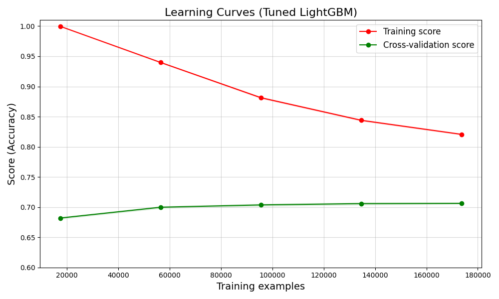
*Figure 11: Learning Curves for the Tuned LightGBM Model*

## 10. References
*   DrivenData Competition: "Richter's Predictor: Modeling Earthquake Damage" (https://www.drivendata.org/competitions/57/nepal-earthquake/)
*   USGS Earthquake Catalog API (https://earthquake.usgs.gov/fdsnws/event/1/)
*   Scikit-learn Documentation (https://scikit-learn.org/stable/documentation.html)
*   LightGBM Documentation (https://lightgbm.readthedocs.io/en/latest/)
*   Streamlit Documentation (https://docs.streamlit.io/)
*   Dong, L., & Shan, J. (2013). A comprehensive review of earthquake-induced building damage detection with remote sensing techniques. *ISPRS Journal of Photogrammetry and Remote Sensing, 84*, 85-99.
*   Borzi, B., Elnashai, A. S., & Pinho, R. (2008). Seismic vulnerability of European reinforced concrete frames. *Engineering Structures, 30*(3), 854-872.
*   Tesfamariam, S., & Liu, Z. (2010). Earthquake induced damage classification for reinforced concrete buildings using fuzzy logic. *Engineering Structures, 32*(11), 3396-3405.
*   Mangalathu, S., Jang, H., Hwang, S.-H., & Jeon, J.-S. (2020). Data-driven Machine-Learning-Based Seismic Failure Mode Identification of Reinforced concrete Shear walls. *Engineering Structures, 208*, 110331.
*   Relevant research papers on the 2015 Gorkha earthquake and seismic vulnerability in Nepal.